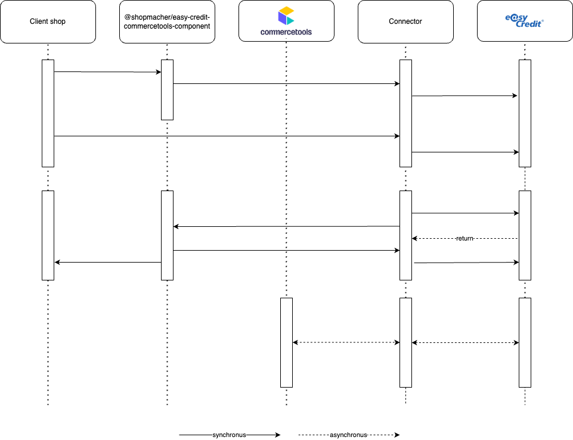

# COMMERCETOOLS EASYCREDIT CONNECTOR

easyCredit-Ratenkauf - use the easiest installment purchase in Germany now.

Our credo of simple, fair and secure applies to both installment purchase customers and retailers. The fast, simple and seamless process with an immediate online credit check can be securely integrated into your online store. We cover the loss risk and you can receive your payment after just three days.

You can rely on our many years of experience in liquidity management and the proven high level of customer satisfaction with easyCredit.

## Advantages for the merchant

- **Simple** - Easy integration of the plugin.

- **Fair** - Simple, transparent pricing model.

- **Secure** - Maximum protection of payment data has top priority.

## Advantages for the end customer

- **Immediate** - Immediate credit decision in the payment process. Conveniently without PostIdent procedure.

- **Fair** - Clear presentation of the installment price without hidden costs or fees.

- **Flexible** - Early repayment and payment breaks by the installment purchase customer possible.

## Product details

- **Purchase amounts**: 200 euros to 10,000 euros

- **Terms**: 2 to 60 months freely selectable

- **Can be used in German online stores**

## 📔 Supported features

### Installment payment

- [Create payments](/docs/CreatePayment.md)
- [Authorize payments](/docs/AuthorizePayment.md)
- [Capture payments](/docs/CapturePayment.md)
- [Refund payments](/docs/RefundPayment.md)

## Prerequisite

1. Commercetools composable commerce account
2. [EasyCredit partner account](https://www.easycredit.de/)

## 📐 Architecture Principles

This repository contains two standalone modules that interact with commercetools and EasyCredit.
Complete integration requires running/intergrating both of the modules. Please find detail information in their readme below

- [Assets](/assets/README.md)
- [Processor](/processor/README.md)

## 🤝 Contributing

Contributions are what make the open-source community such an amazing place to learn, inspire, and create. Any contributions you make are greatly appreciated.

Please follow these file for further information on how to contribute to this repository.

- [Contributing guideline](/docs/CONTRIBUTING.md)
- [Issue template](/docs/IssueTemplate.md)

## 📝 License

Distributed under the MIT License. See [LICENSE](/LICENSE) for more information.

## 📞 Contact

Are you interested and would like to use easyCredit-Ratenkauf?

Simply get in touch with us at

[sales.ratenkauf@easycredit.de](mailto:sales.ratenkauf@easycredit.de)

[+49 (0) 911 5390 2726](tel:+4991153902726)

Or register directly here:

[https://partner.easycredit-ratenkauf.de/registrierung](https://partner.easycredit-ratenkauf.de/registrierung)

Please note that you need a valid contract to use the connector.

 <b>Happy Coding! 🚀</b> 

