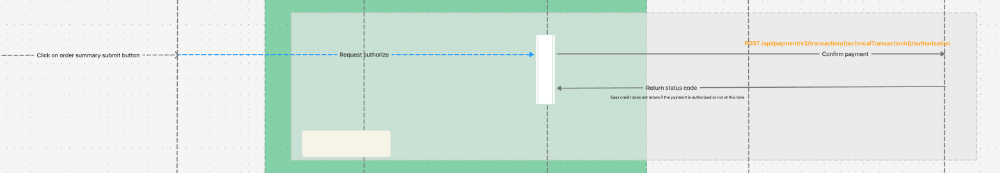

# Authorize Payment

* [Authorize EC transaction](#workflow)
* [Response Format](#success-response-204)
* [Error Handling](#error-response-4xx)

## Overview
This API is designed to authorize EC payment using the provided CT `paymentId`.
<br />

## Conditions

To use this functionality, the following conditions must be met:

1. A valid `paymentId` must be provided in associated with an existing payment holding an `pre authorized EC transaction` in CommerceTools.
2. The session must be authenticated, and a valid session token must be included in the request.
<br />

## Workflow

1. **Validate and get `payment`**: Use `paymentId` to get related CT `payment` data.
2. **Retrieve EC `technicalTransactionId`**: The id is stored in a custom field named `easyCreditTechnicalTransactionId` under the payment transaction
3. **Authorize & update payment**: With the `technicalTransactionId`, a request is sent to authorize this transaction and update the transaction state accordingly


<br />

## Example URL Call

To authorize a payment, you can make a call to the following URL. Ensure to include the session header for authentication.

### Request

**HTTP Method:** `POST`  
**URL:** `https://your-api-endpoint.com/payments/{payment_id}/authorize`  
**Headers:**
```http
X-Session-Id: <session_id>
Content-Type: application/json
```

To obtain the `X-Session-Id`, refer to the [CommerceTools Sessions API documentation](https://docs.commercetools.com/checkout/installing-checkout#create-checkout-sessions).
<br />

### Response Format

#### Success Response 204:
On successful authorize the payment, the API returns a `204 No content` response.

#### Error Response 4xx:
If the provided `payment_id` is invalid, or if there is an issue with the session token, the API will return a `404 Not found` error:

```json
{
    "message": "The Resource with ID '8efc676b-1069-437-87e2-ad3bba70e35b' was not found.",
    "statusCode": 404,
    "errors": [
        {
            "code": 404,
            "message": "The Resource with ID '8efc676b-1069-437-87e2-ad3bba70e35b' was not found.",
            "fields": [
                {
                    "code": "ResourceNotFound",
                    "message": "The Resource with ID '8efc676b-1069-437-87e2-ad3bba70e35b' was not found."
                }
            ]
        }
    ]
}
```


