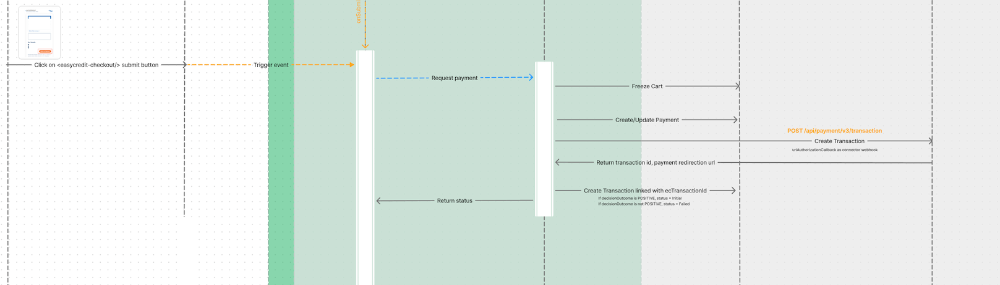

# Create Payment

* [Create payment workflow](#workflow)
* [Example request](#request)
* [Response Format](#success-response)
* [Error response](#error-response-4xx)

## Overview
This API is designed to create payment details from CommerceTools using the provided `cartId`, needed `redirectLinks` and `customerRelationship` data.
<br />

## Conditions

To use this functionality, the following conditions must be met:

1. A valid `cartId` must be provided, corresponding to a cart in CommerceTools.
2. The session must be authenticated, and a valid session token must be included in the request.
<br />

## Workflow

1. **Validate and get `cart`**: Retrieve CT `cart` instance by `cartId` and validate its addresses and currency.
2. **Check payment type availability**: The cart total must be within the limits of the payment type, and the payment type must be activated for the webshop. Activation status and limits come from the easyCredit webshop endpoint (`GET /payment/v3/webshop/{webShopId}`), see [Payment type availability](#payment-type-availability).
3. **Create CT Payment**: Create using the above `cart`.
4. **Create EC transaction**: Convert CT data into EC data and create the transaction.
5. **Retrieve Payment from Easy Credit**: The `interactionId` from the CommerceTools transaction is used to fetch additional payment details from Easy Credit.
6. **Update CT payment with final status**: Retrieve EC transaction status and update the CT payment transaction.


<br />

## Payment type availability

The transaction is currently always initialized with `INSTALLMENT_PAYMENT`, since the checkout component only supports installment payment. It is rejected before any CT payment is created if:

- no usable webshop configuration is available, see [Webshop configuration](GetPaymentMethod.md#webshop-configuration) (`503 EasyCreditUnavailable`),
- easyCredit reports `availability: false` or `installmentPaymentActive: false` for the webshop (`400 PaymentTypeNotAvailable`),
- the cart total is outside `minInstallmentValue` / `maxInstallmentValue` (`400 InvalidAmount`).

The optional request field `paymentType` defaults to `INSTALLMENT_PAYMENT`. Explicit `BILL_PAYMENT` requests return `400 PaymentTypeNotAvailable` before any cart mutation, webshop lookup or payment creation. Bill checkout remains deferred to TEBA-248/249; a GET response with `BILL_PAYMENT.available: true` does not enable it.

Caching and retries of the webshop configuration are described in [Get Payment Method](./GetPaymentMethod.md#webshop-configuration). The limits are defined by easyCredit per webshop and cannot be configured in the connector.
<br />

## Example URL Call

To create a payment, you can make a call to the following URL. Ensure to include the session header for authentication.

### Request

**HTTP Method:** `POST`  
**URL:** `https://your-api-endpoint.com/payments/`  
**Headers:**
```http
X-Session-Id: <session_id>
Content-Type: application/json
```

To obtain the `X-Session-Id`, refer to the [CommerceTools Sessions API documentation](https://docs.commercetools.com/checkout/installing-checkout#create-checkout-sessions).

**Parameters:**

```json
{
    // cartId of a valid cart
    // a valid cart must have
    //     a total amount within the limits of the webshop (minInstallmentValue <= amount <= maxInstallmentValue)
    //     a valid shipping address
    "cartId": "YOUR_CART_ID", 
    "redirectLinks": {
        "urlSuccess": "https://example.com/success",
        "urlCancellation": "https://example.com/cancellation",
        "urlDenial": "https://example.com/denial"
    },
    "customerRelationship": {
        "customerStatus": "NEW_CUSTOMER",
        "customerSince": "yyyy-MM-dd",
        "numberOfOrders": 0
    }
}
```

### Response Format

#### Success Response:

On successful creation of a payment, the API returns a `201 Created` response along with the following structure:

```json
{
    "technicalTransactionId": "c2b818bb.1120065723LwY1rRZcggpX9az7qUgAvdEh",
    "paymentId": "25559370-d4a0-4291-b84e-b0f7e46d6972",
    "redirectUrl": "https://ratenkauf.easycredit.de/app/payment/c2b818bb.1120065723LwY1rRZcggpX9az7qUgAvdEh/finanzierungsvorgaben",
    "transactionInformation": {
        "status": "OPEN",
        "decision": {
            "decisionOutcome": "",
            "decisionOutcomeText": null
        }
    }
}
```

#### Error Response 4xx:  

If the provided `cartId` is invalid, or if there is an issue with the session token, the API will return a `404 Not found` error:

```json
{
    "message": "The Resource with ID '35c84223c-d598-4d76-a059-ed5b3da396b7' was not found.",
    "statusCode": 404,
    "errors": [
        {
            "code": 404,
            "message": "The Resource with ID '35c84223c-d598-4d76-a059-ed5b3da396b7' was not found.",
            "fields": [
                {
                    "code": "ResourceNotFound",
                    "message": "The Resource with ID '35c84223c-d598-4d76-a059-ed5b3da396b7' was not found."
                }
            ]
        }
    ]
}
```

#### Error Response 400:

If the cart fails validation, the API returns a `400 Bad Request` error. The payment type checks produce these error codes:

| Code | Reason |
| --- | --- |
| `InvalidAmount` | The cart total is outside the limits of the payment type. The message contains the limits returned by easyCredit. |
| `PaymentTypeNotAvailable` | The payment type is not activated for the webshop. |

Example for a webshop whose installment limits are 200 € to 10.000 €:

```json
{
    "message": "Die Summe des Warenkorbs muss zwischen 200€ und 10.000€ liegen.",
    "statusCode": 400,
    "errors": [
        {
            "code": "InvalidAmount",
            "message": "Die Summe des Warenkorbs muss zwischen 200€ und 10.000€ liegen.",
            "fields": {
                "webShopId": "2.de.7607.2"
            }
        }
    ]
}
```
