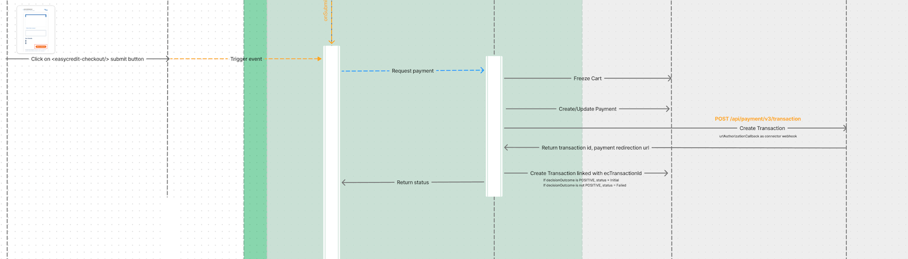

# Create Payment

* [Create payment workflow](#workflow)
* [Example request](#request)
* [Response Format](#success-response)
* [Error response](#error-response-4xx)

## Overview
This API is designed to create payment details from CommerceTools using the provided `cartId`, needed `redirectLinks` and `customerRelationship` data.
<br />

## Conditions

To use this functionality, the following conditions must be met:

1. A valid `cartId` must be provided, corresponding to a cart in CommerceTools.
2. The session must be authenticated, and a valid session token must be included in the request.
<br />

## Workflow

1. **Validate and get `cart`**: Retrieve CT `cart` instance by `cartId`.
2. **Create CT Payment**: Create using the above `cart`.
3. **Create EC transaction**: Convert CT data into EC data and create the transaction.
4. **Retrieve Payment from Easy Credit**: The `interactionId` from the CommerceTools transaction is used to fetch additional payment details from Easy Credit.
5. **Update CT payment with final status**: Retrieve EC transaction status and update the CT payment transaction.


<br />

## Example URL Call

To create a payment, you can make a call to the following URL. Ensure to include the session header for authentication.

### Request

**HTTP Method:** `POST`  
**URL:** `https://your-api-endpoint.com/payments/`  
**Headers:**
```http
X-Session-Id: <session_id>
Content-Type: application/json
```

To obtain the `X-Session-Id`, refer to the [CommerceTools Sessions API documentation](https://docs.commercetools.com/checkout/installing-checkout#create-checkout-sessions).

**Parameters:**

```json
{
    // cartId of a valid cart
    // a valid cart must has 
    //     200 < {cart total amount} < 10000
    //     a valid shipping address
    "cartId": "YOUR_CART_ID", 
    "redirectLinks": {
        "urlSuccess": "https://example.com/success",
        "urlCancellation": "https://example.com/cancellation",
        "urlDenial": "https://example.com/denial"
    },
    "customerRelationship": {
        "customerStatus": "NEW_CUSTOMER",
        "customerSince": "yyyy-MM-dd",
        "numberOfOrders": 0
    }
}
```

### Response Format

#### Success Response:

On successful create a payment, the API returns a `200 OK` response along with the following structure:

```json
{
    "technicalTransactionId": "c2b818bb.1120065723LwY1rRZcggpX9az7qUgAvdEh",
    "paymentId": "25559370-d4a0-4291-b84e-b0f7e46d6972",
    "redirectUrl": "https://ratenkauf.easycredit.de/app/payment/c2b818bb.1120065723LwY1rRZcggpX9az7qUgAvdEh/finanzierungsvorgaben",
    "transactionInformation": {
        "status": "OPEN",
        "decision": {
            "decisionOutcome": "",
            "decisionOutcomeText": null
        }
    }
}
```

#### Error Response 4xx:  

If the provided `cartId` is invalid, or if there is an issue with the session token, the API will return a `404 Not found` error:

```json
{
    "message": "The Resource with ID '35c84223c-d598-4d76-a059-ed5b3da396b7' was not found.",
    "statusCode": 404,
    "errors": [
        {
            "code": 404,
            "message": "The Resource with ID '35c84223c-d598-4d76-a059-ed5b3da396b7' was not found.",
            "fields": [
                {
                    "code": "ResourceNotFound",
                    "message": "The Resource with ID '35c84223c-d598-4d76-a059-ed5b3da396b7' was not found."
                }
            ]
        }
    ]
}
```


