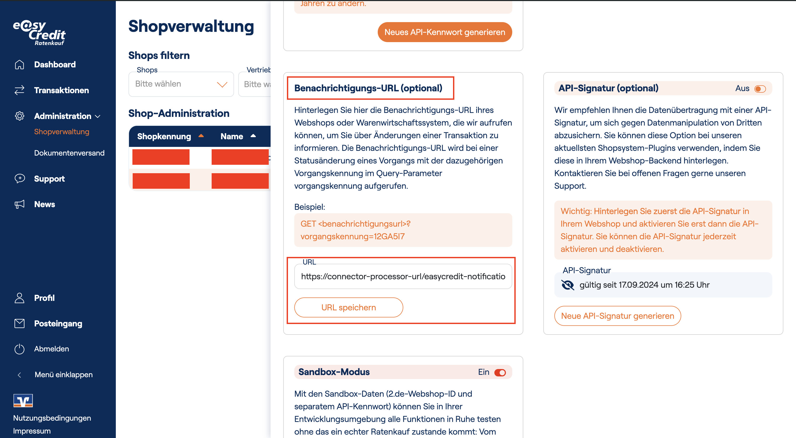

# Triggering Refunding Easycredit Payment

This guide provides instructions on how to trigger a Refund for an Easycredit payment from CommerceTools shop side.

## Table of Contents

- [API endpoint](#api-endpoint)
- [Process](#process)
- [Handling Notification](#handling-notification)

## API endpoint

- We provide an endpoint `POST /payments/:paymentId/refund` to trigger the Refund for an Easycredit payment. The endpoint requires:
  - Headers:
    - `Authorization`: Require CommerceTools access token which can be obtained from their auth endpoint and with your CommerceTools credentials
  - Params:
    - `paymentId`: The CommerceTools Payment ID
  - Payload:
    - `amount`: The amount that you want to refund

- Request example:
  ```
    curl --location '{{connectorProcessorUrl}}/payments/{{paymentId}}/refund' \
    --header 'Authorization: Bearer {{accessToken}}' \
    --header 'Content-Type: application/json' \
    --data '{
        "amount": 2.5
    }'
  ```

## Process

- When you call the endpoint, it will start to check the following conditions:
  - The CommerceTools Payment should be existed
  - The CommerceTools Payment amount (in EUR) must be greater than 0 and greater than the refunding amount
  - The CommerceTools Payment `paymentMethodInfo.paymentInterface` is `easycredit`
  - The CommerceTools Payment must have a transaction with type = `Authorization`, state = `Success` and `interactionId` is defined and a easycredit payment is found with the `technicalTransactionId` is the value of the transaction's `interactionId`

- After validating completely, the connector will first create a new transaction for the refund. The transaction will have type = `Refund`, state = `Initial` and the amount is the refunding amount

- Next, the connector will create a Refund request for the Easycredit payment we found above

- Following the [Easycredit docs](https://developer.easycredit-ratenkauf.de/documentation/dokumentation-transaction-api-v3/), a successful refund request will return 202 as status code.
So if the connector received 202 as status code, it will update the above Initial Refund transaction, change its state to `Pending` otherwise it will be changed to `Failure`

- Then, the process of triggering the refund is done. However, the refund request will need time to be processed and we cannot wait for it to be done. However, the EasyCredit provide us a feature to receive new notifications about the resource called [Benachrichtigungs-URL](https://developer.easycredit-ratenkauf.de/documentation/anleitung-einbindung-transaction-api-v3/#2003044967732465). Our connector also supports this feature, all you need to do is open your EasyCredit portal account, and register our endpoint: `GET /easycredit-notification`

## Handling notification

- Like what we just explained above, we provide an endpoint for EasyCredit to notify us whenever a refund has been processed completely. It is `GET /easycredit-notification`

- For example, a refund just happened successfully in an EasyCredit's transaction, if you registered the above endpoint to your EasyCredit portal already, EasyCredit will notify you via that endpoint with a param in the URL, for example: `/easycredit-notification?vorgangskennung=V8RW8H`. The `V8RW8H` is EasyCredit's transaction ID. We will use it to query and get the correct CommerceTools Payment object, then update its pending refund accordingly.

- Steps to register Notification URL:
  - Access the [portal site](https://partner.easycredit-ratenkauf.de/portal/shopverwaltung)
  - Go to Administration -> Shopverwaltung
  - Click on the specific Web Shop ID, you will see the place to fill in the value for Benachrichtigungs-URL
  - 