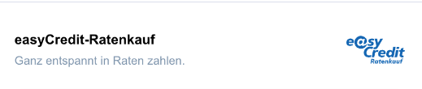
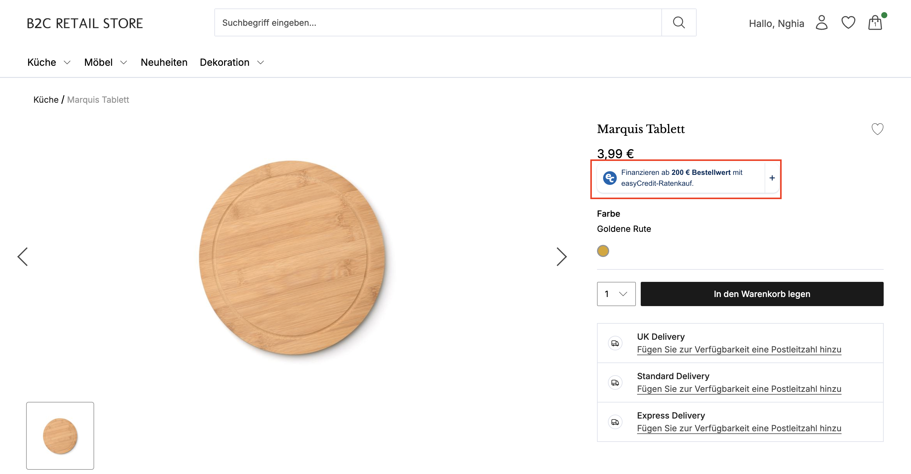
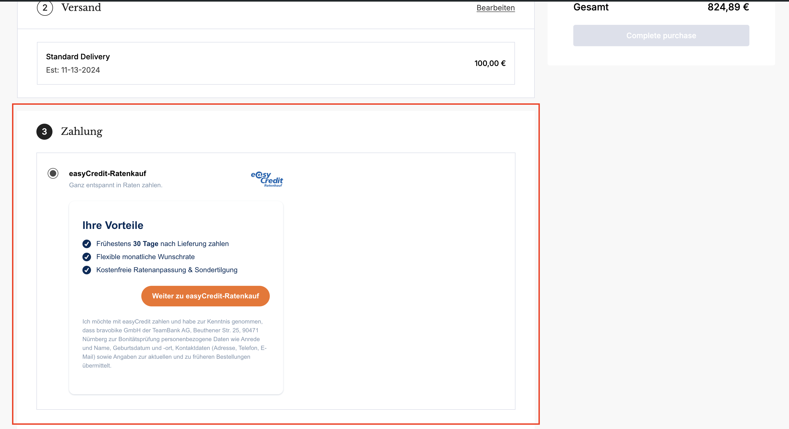
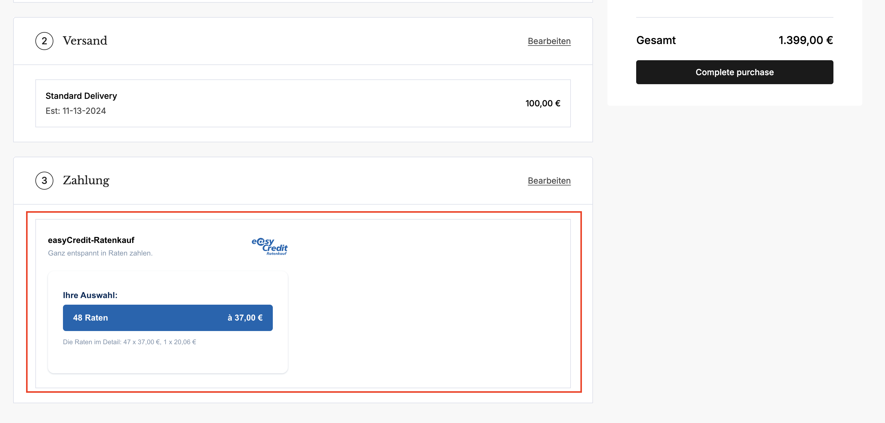

# Connector Web Components Integration Guide

This guide provides instructions on how to integrate and display the connector's provided web-components which are [EasyCredit Web Components](https://netzkollektiv.com/docs/easycredit-components/?path=/docs/getting-started-installation--docs) but with our connector's validation logic.

## Table of Contents

- [Step 1: Configuration](#step-1-configure-widget-settings)
- [Step 2: Initialize and Display the components](#step-2-initialize-and-display-the-widget)
- [Step 3: Troubleshooting](#step-4-handling-widget-events)

## Step 1: Configuration

- First, after install the connector into the shop, you must config all the necessary credentials that defined in the processor part, you can have a look at [this file](../connect.yaml)

- Then, in your shop, you need to install our package to use provided components:
  - Install via npm package \
    Simply run `npm i easy-credit-commercetools-component`.\
    For more details about the package, please have a look at [this site](https://www.npmjs.com/package/easy-credit-commercetools-component)
  - Install via CT connector asset service url \
    After installing the connector, an URL will be generated hosting the required package. \
    Simply include this URL as follow \
    ```
    <script type="module" src="YOUR_ASSET_URL_HERE" />
    ```

## Step 2: Initialize and Display the components

- We provide you a way to initialize the components easily just with a short Javascript script. You can have a look at the [demo file](../assets/index.html)
- Currently, we have 3 components which created from EasyCredit Web Components:

### Label component

- Created from [EasyCredit Label component](https://netzkollektiv.com/docs/easycredit-components/?path=/docs/checkout-label--docs)
- It is handled in [label.component.ts](../assets/src/components/label.component.ts)
- To use this component, you need to integrate this short snippet into your shop:

  ```
    const enabler = new Enabler({
      processorUrl: 'https://service-bk5phtyi8svk2ne51fw3ulsn.europe-west1.gcp.commercetools.app/', // Connector's processor URL
      sessionId: session.token, // CommerceTools session ID
    });

    enabler.createLabelBuilder().then((labelBuilder: any) => {
          const labelComponent = labelBuilder.build({});
          labelComponent.mount('#easycredit-checkout-label');
          setLabelLoaded(true);
        });
  ```

- By doing this, the component will make API calls to the connector to check whether the component can be displayed or not, if it is able to be displayed, the result will be like the image below: 

### Widget component

- Created from [EasyCredit Widget component](https://netzkollektiv.com/docs/easycredit-components/?path=/docs/marketing-widget--docs)
- It is handled in [widget.component.ts](../assets/src/components/widget.component.ts)
- To display the EasyCredit Widget, which mostly been used in the PDP of every shop, you need to make sure that the `WEBSHOP_ID` is set up correctly and the `WIDGET_ENABLED` is set to be `1`
- Then, in the shop side, you need to integrate this short snippet:

  ```
    const enabler = new Enabler({
      processorUrl: 'https://service-bk5phtyi8svk2ne51fw3ulsn.europe-west1.gcp.commercetools.app/', // Connector's processor URL
      sessionId: sessionToken, // CommerceTools session ID
    });

    const widgetBuilder = await enabler.createWidgetBuilder();

    const widgetComponent = widgetBuilder.build({
      amount: totalValue, // Cart amount
    });

    // Mount the new widget
    widgetComponent
      .mount('#easycredit-cart') // The place to display the component
      .then((res: any) => {
        console.log('mounted successfully', res);
      })
      .catch((error: any) => {
        console.log('failed to mount', error);
      });
  ```

- By doing this, the component will make API calls to the connector to check whether the widget can be displayed or not, if it is able to be displayed, the result will be like the image below: 

### Checkout component

- Created from [EasyCredit Label component](https://netzkollektiv.com/docs/easycredit-components/?path=/docs/checkout-label--docs) and [EasyCredit Checkout component](https://netzkollektiv.com/docs/easycredit-components/?path=/docs/checkout-checkout--docs)
- It is handled in [checkout.component.ts](../assets/src/components/checkout.component.ts)
- To use this component, you need to integrate this short snippet into your shop:

  ```
    const enabler = new Enabler({
      processorUrl: 'https://service-bk5phtyi8svk2ne51fw3ulsn.europe-west1.gcp.commercetools.app/', // Connector's processor URL
      sessionId: session.token, // CommerceTools session ID
    });

    enabler.createCheckoutBuilder().then((checkoutBuilder: any) => {
      const checkoutComponent = checkoutBuilder.build({
        cartId: cart.cartId,
        redirectLinks: {
          urlSuccess: window.location.origin + window.location.pathname + '?step=3',
          urlCancellation: window.location.origin + window.location.pathname + '?step=2&status=cancelled',
          urlDenial: window.location.origin + window.location.pathname + '?step=2&status=denied',
        },
        customerRelationship: {
          customerStatus: loggedIn === true ? 'EXISTING_CUSTOMER' : 'NEW_CUSTOMER',
          customerSince: account?.createdAt,
          numberOfOrders: myOrdersCount,
        },

        onError: (err: any) => {
          console.error('onError', err);
        },

        onSuccess: (response: any) => {
          console.log('connector handled it successfully', response);

          window.location.replace(response?.redirectUrl);
        },
      });

      checkoutComponent
        .mount('#easycredit-checkout') // The place to display the component
        .then((res: any) => {
          console.log('mounted successfully', res);
        })
        .catch((error: any) => {
          console.log('failed to mount', error);
        });
    });
  ```

- By doing this, the component will make API calls to the connector to check whether the component can be displayed or not, if it is able to be displayed, the result will be like the image below: 

### Summary component

- Created from [EasyCredit Label component](https://netzkollektiv.com/docs/easycredit-components/?path=/docs/checkout-label--docs) and [EasyCredit Checkout component](https://netzkollektiv.com/docs/easycredit-components/?path=/docs/checkout-checkout--docs)
- It is handled in [summary.component.ts](../assets/src/components/summary.component.ts)
- To use this component, you need to integrate this short snippet into your shop:

  ```
    enabler = new Enabler({
      processorUrl: 'https://service-bk5phtyi8svk2ne51fw3ulsn.europe-west1.gcp.commercetools.app/', // Connector's processor URL
      sessionId: session.token, // CommerceTools session ID
    });

    enabler.createSummaryBuilder().then((summaryComponentBuilder: any) => {
      const summaryComponent = summaryComponentBuilder.build({
        paymentId: easyCreditPayment.id,
      });

      summaryComponent
        .mount('#easycredit-summary') // The place to display the component
        .then((res: any) => {
          console.log('mounted successfully', res);
        })
        .catch((error: any) => {
          console.log('failed to mount', error);
        });
    });
  ```

- By doing this, the component will make API calls to the connector to check whether the component can be displayed or not, if it is able to be displayed, the result will be like the image below: 

## Step 3: Troubleshooting

- When integrating, if any unexpected behavior occurs, check the Console tab in Dev Tools for errors that may assist in troubleshooting.
