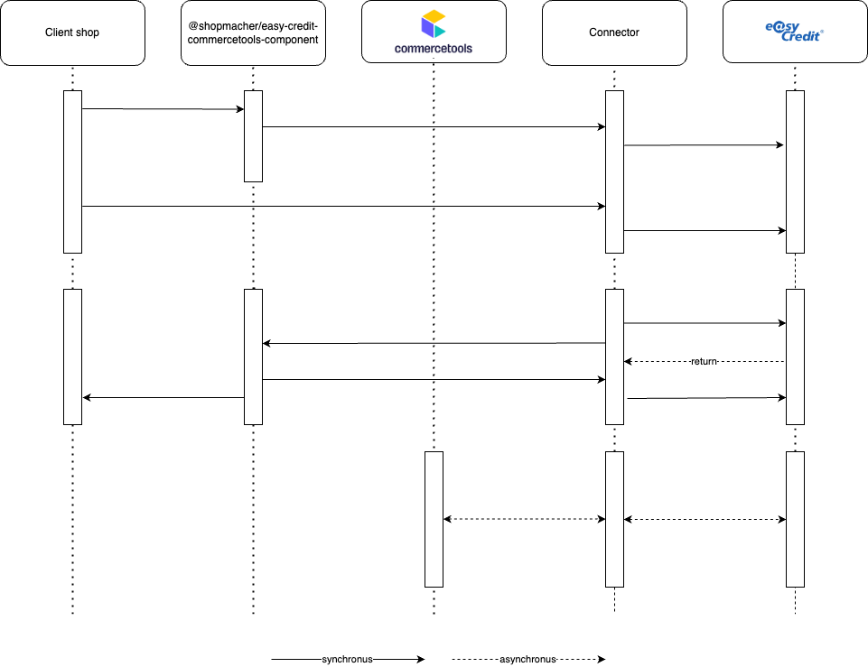

# Connector Processor Integration Guide

This guide provides information on the functionality of the processor connector.

## 📐 Architecture Principles

This repository contains two standalone modules that interact with commercetools and EasyCredit.
Complete integration requires running/intergrating both of the modules. Please find detail information in their readme below

## Table of Contents

- [Basic configs](#configure-processor-settings)
- [Features](#features)
- [Troubleshooting](#troubleshooting)

## Configure processor settings

- First, after install the connector into the shop, you must config all the necessary credentials that defined in the processor part, you can have a look at [this file](../connect.yaml)

| Configuration | Description |
| --- | --- |
| WEBSHOP_ID | EasyCredit WebShop ID from your portal. We need it to be authorized when calling EasyCredit APIs. |
| API_PASSWORD | EasyCredit API Password from your portal. We need it to be authorized when calling EasyCredit APIs. |
| WIDGET_ENABLED | 0 or 1, used to define whether the EasyCredit Info Widget can be displayed or not. |
| CTP_CLIENT_ID | CommerceTools Composable Commerce client ID. |
| CTP_CLIENT_SECRET | CommerceTools Composable Commerce client secret. |
| CTP_PROJECT_KEY | CommerceTools Composable Commerce project key |
| CTP_SCOPES | CommerceTools Composable Commerce scope (should be: manage_project). |
| CTP_REGION | CommerceTools Composable Commerce API region. |
| CTP_API_URL | commercetools API URL |
| CTP_AUTH_URL | CommerceTools Composable Commerce Authentication endpoint. Used to initialize the CommerceTools Payment SKD inside the connector. Then, we use the Payment SDK to secure the connector’s endpoints which require CommerceTools access token. |
| CTP_SESSION_URL | CommerceTools Composable Commerce Session endpoint. Used to initialize the CommerceTools Payment SKD inside the connector. Then, we use the Payment SDK to secure the connector’s endpoints which require CommerceTools sessions. |
| CTP_JWKS_URL | CommerceTools Composable Commerce JWT keys set endpoint e.g: https://mc-api.europe-west1.gcp.commercetools.com/.well-known/jwks.json. Used to initialize the CommerceTools Payment SKD inside the connector. |
| CTP_JWT_ISSUER |  CommerceTools Composable Commerce JWT Issuer for JWT validation e.g: https://mc-api.europe-west1.gcp.commercetools.com/. Used to initialize the CommerceTools Payment SKD inside the connector. |
| DEBUG | 0 or 1, if it is enabled (= 1), the logger of the connector will display log message from debug level. |
| BILL_PAYMENT_ENABLED | 0 or 1 (default 0). Reports easyCredit pay by invoice as available in the payment method response if this is 1, easyCredit reports `availability: true` and `billPaymentActive: true` for the webshop, and the cart total is within `minBillingValue` / `maxBillingValue`. The checkout component does not support pay by invoice yet, so it is not offered to customers. |
| WEBSHOP_CACHE_TTL | Seconds (0 to 3600, default 300) to cache the easyCredit webshop configuration: activation status and order value limits per payment type. |

## Features
Follow the link for further information of each feature.
| Feature | Documentations |
|---|---|
| Get payment method | [LINK](/docs/GetPaymentMethod.md) |
| Get payment | [LINK](/docs/GetPayment.md) |
| Create payment | [LINK](/docs/CreatePayment.md) |
| Authorize payment | [LINK](/docs/AuthorizePayment.md) |
| Cancel payment | [LINK](/docs/CancelPayment.md) |
| Capture payment | [LINK](/docs/CapturePayment.md) |
| Refund payment | [LINK](/docs/RefundPayment.md) |

## Troubleshooting

- When integrating, if any unexpected behavior occurs, check the **App Logs** of the processor for errors that may assist in troubleshooting.
